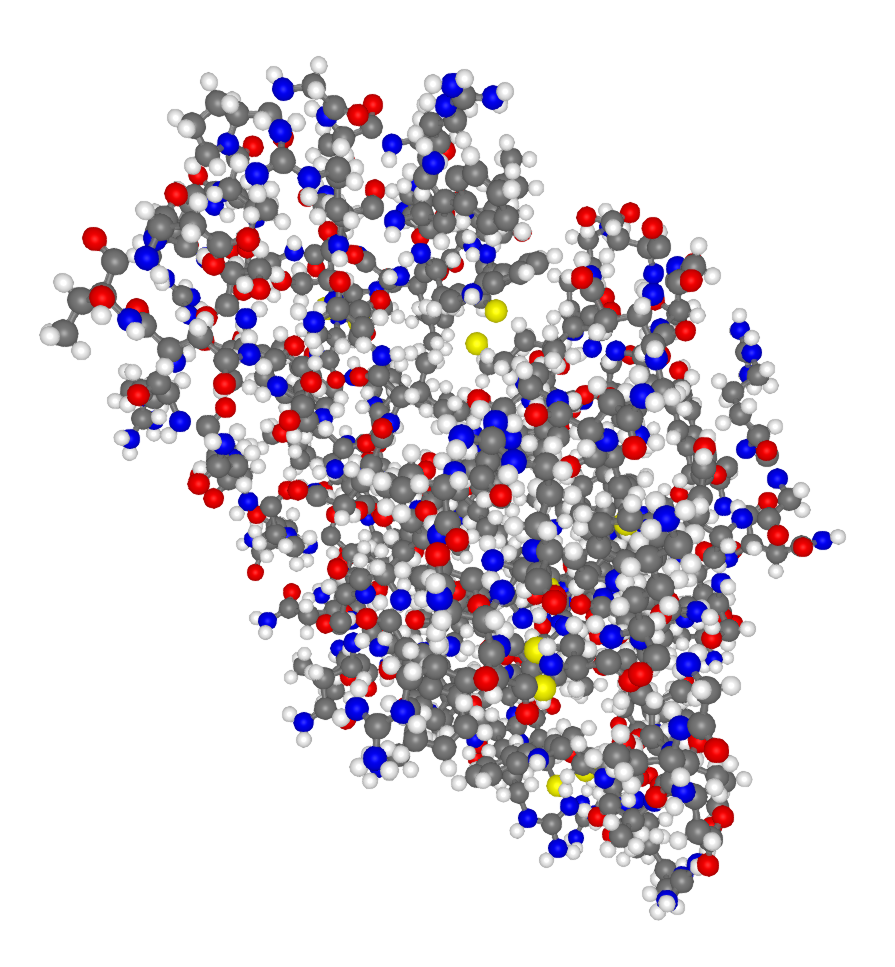
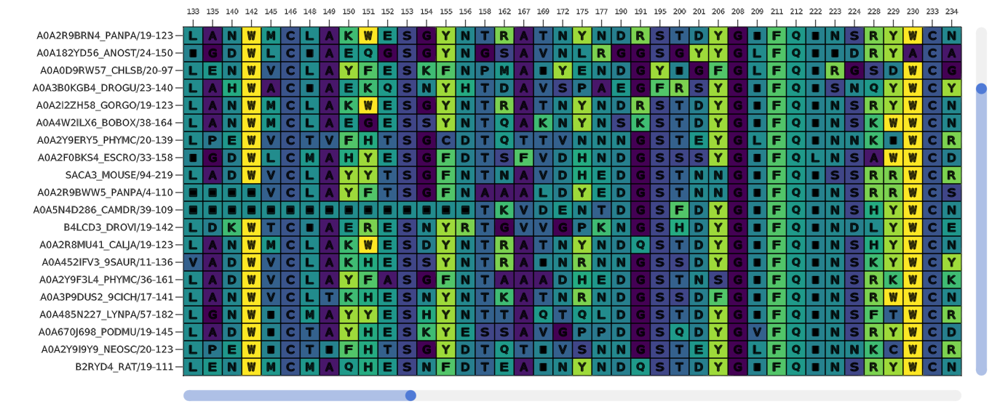

# BioMakie

## Installation and Setup

This package contains visual utilities for biodata, mostly proteins. 
At the moment it might be best to add the package like so:
```julia
julia> ] add 'https://github.com/kool7d/BioMakie.jl'
julia> using BioMakie
```
## Usage

To view a PDB structure, use the `viewstruc` function with a PDB ID or BioStructures protein structure.
```julia
using BioStructures
struc = retrievepdb("2vb1", dir = "data\\") |> Node
sv = viewstruc(struc)

struc = read("data\\2vb1_mutant1.pdb", BioStructures.PDB) |> Node
sv = viewstruc(struc)
```
<p align="center">
  
</p>

To view a multiple sequence alignment, use the `viewmsa` function with a Pfam ID or fasta file.
```julia
using MIToS.MSA
downloadpfam("pf00062")
vm = MIToS.MSA.read("pf00062.stockholm.gz",Stockholm) |> Node
fig1 = viewmsa(vm)

using FastaIO
vm = FastaIO.readfasta("data/fasta1.fas") |> Node
fig1 = viewmsa(vm)
```

