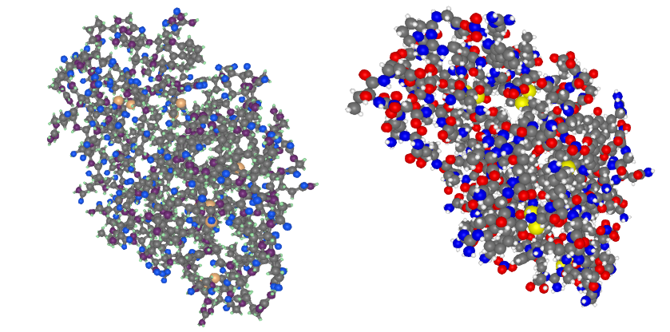
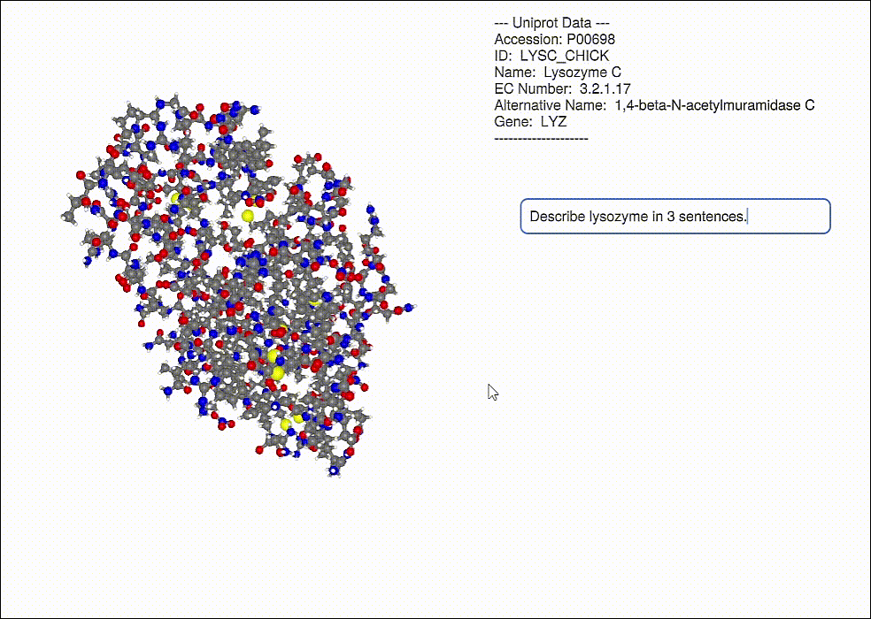
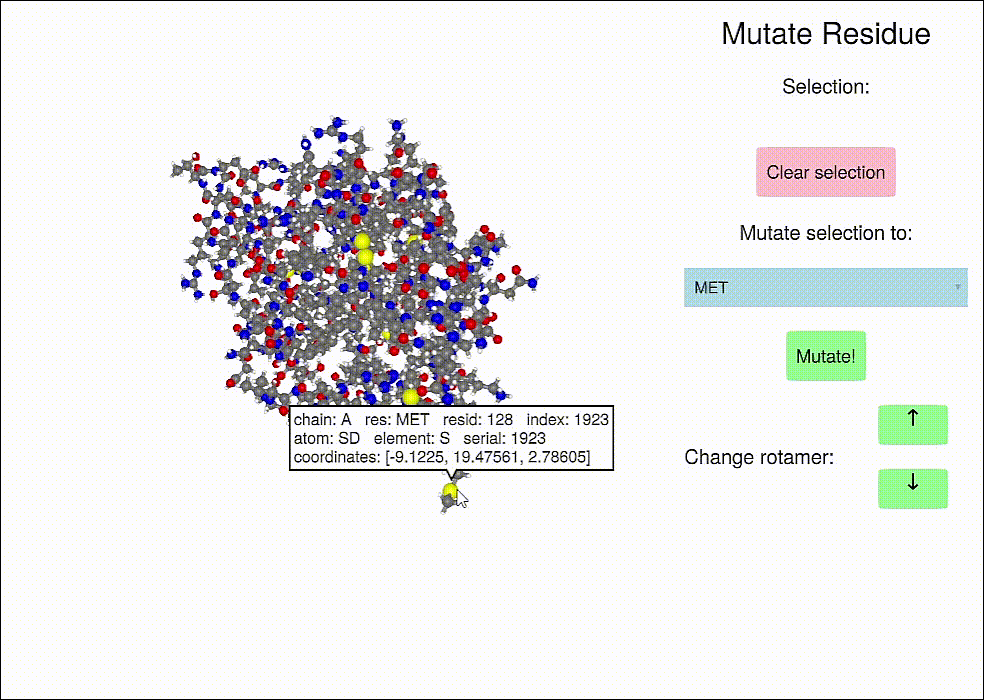

<p align="center"></p>

## **Status:**
## Version 0.4.0 has broken some machinery... fix incoming... use v0.3.0 instead for now to try it out?  **`add BioMakie#v0.3.0`**

[](https://github.com/BioJulia/BioMakie.jl/releases/latest)
[](https://github.com/BioJulia/BioMakie.jl/blob/master/LICENSE.md)
[](https://github.com/BioJulia/BioMakie.jl/actions/workflows/ci.yml)

**Documentation:**

[](https://BioJulia.github.io/BioMakie.jl/dev)

<!-- [](http://codecov.io/github/BioJulia/BioMakie.jl?branch=master) -->

## Installation

To install BioMakie, access the Julia package REPL by
pressing **`]`** from the Julia REPL, then run **`add BioMakie`**.

## Contributing and questions

Anyone can contribute to this package, by doing things like reporting bugs, fixing issues,
improving performance, adding new features, and adding examples. Feel free to open an **Issue** or **Pull Request**,
or communicate on the **#biology** or **#makie** channels of the [Julia Slack](https://join.slack.com/t/julialang/shared_invite/zt-1ab2rnvlw-mfODD9DJC_apVEULyKXDrA).

## About

This package provides plotting functions for protein structures, multiple sequence alignments, and some other related plots like protein structure contact maps. 
It also provides more complicated examples that show off additional functionality and interfaces. 
The main plotting functions are **plotstruc** and **plotmsa**, along with their mutating versions, **plotstruc!** and **plotmsa!**.

```julia
using BioMakie
using GLMakie
using BioStructures
struc = retrievepdb("2vb1") |> Observable
## or
struc = read("2vb1.pdb", BioStructures.PDBFormat) |> Observable

fig = Figure()
plotstruc!(fig, struc; plottype = :ballandstick, gridposition = (1,1), atomcolors = aquacolors)
plotstruc!(fig, struc; plottype = :covalent, gridposition = (1,2))
```
<p align="center"></p>

To view a multiple sequence alignment, use the `plotmsa` function with a Pfam MSA or fasta file.

```julia
using FASTX
reader = open(FASTX.FASTA.Reader, "PF00062_full.fasta")
msa = [reader...] |> Observable
close(reader)
## or 
using MIToS.MSA
msa = read_file("pf00062.stockholm.gz", Stockholm)

fig = plotmsa(msa; colorscheme = :tableau_blue_green)
```
<p align="center"></p>

## Other examples

### Viewing the frequencies of amino acids in a multiple sequence alignment

<p align="center"></p>

### Alpha shapes can be used to visualize the surface of a protein structure

<p align="center"></p>

### Database information can be displayed for a protein (including a GPT response, OpenAI.jl)

<p align="center"></p>

### Protein residue mutation and changing rotamers (with ProtoSyn.jl) 

<p align="center"></p>
