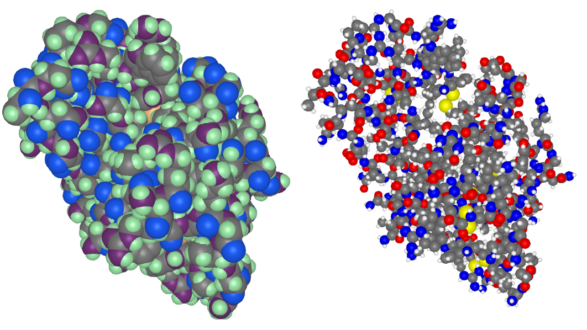
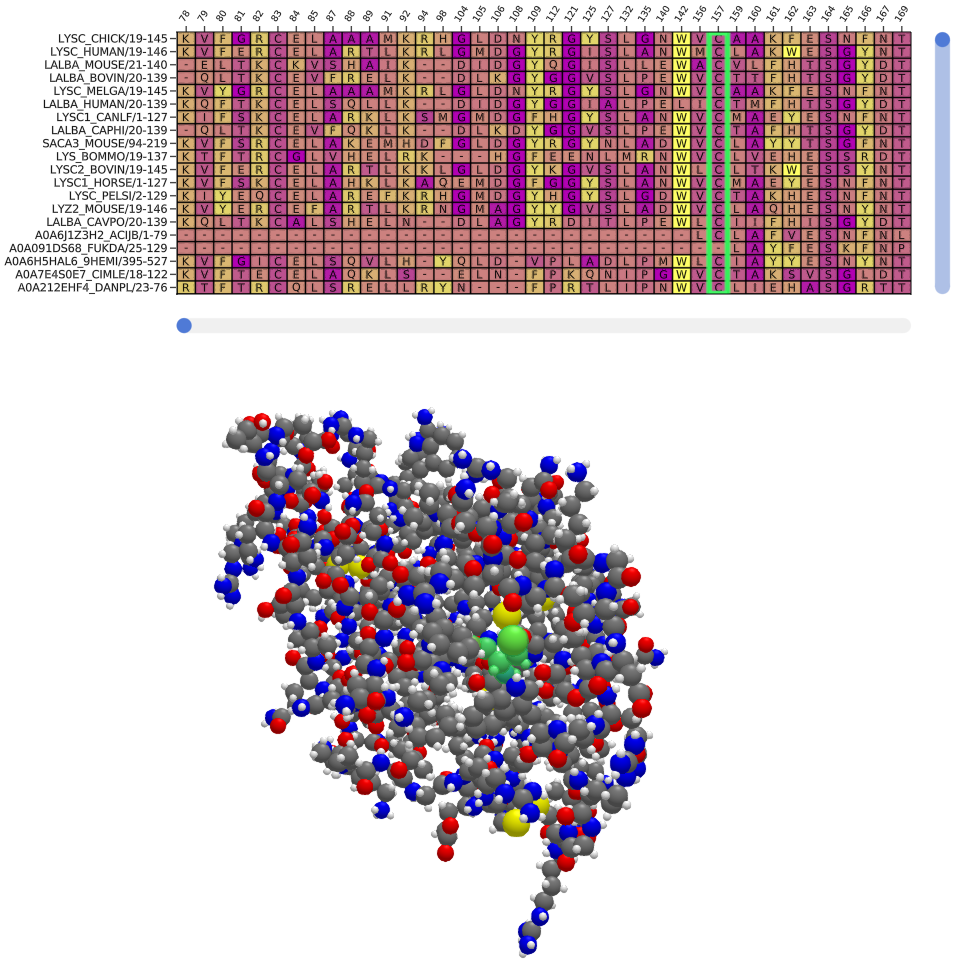

# BioMakie.jl
[](https://kool7d.github.io/BioMakie.jl/stable)
[](https://kool7d.github.io/BioMakie.jl/dev)

[](https://github.com/kool7d/BioMakie.jl/actions?query=workflow%3ACI+branch%3Amaster)
<!-- [](http://codecov.io/github/kool7d/BioMakie.jl?branch=master) -->

## Installation

Julia is required. Install the BioMakie master branch from the Julia REPL. 
Enter the package mode by pressing ] and run:
`add BioMakie`.

## Usage

To view a protein, use the `plotstruc` function with a BioStructures 
or MIToS structure.

```julia
using BioStructures
struc = retrievepdb("2vb1", dir = "data\\") |> Observable
# or #
struc = read("data\\2vb1.pdb", BioStructures.PDB) |> Observable

fig = Figure()
plotstruc!(fig, struc; plottype = :spacefilling, gridposition = (1,1), atomcolors = aquacolors)
plotstruc!(fig, struc; plottype = :covalent, gridposition = (1,2))
```
<p align="center"></p>

To view a multiple sequence alignment, use the `plotmsa` function with a Pfam MSA or fasta file.

```julia
using MIToS.MSA
downloadpfam("pf00062")
msa = MIToS.MSA.read("pf00062.stockholm.gz",Stockholm) |> Observable

msamatrix, xlabel, ylabel = getplottingdata(msa) .|> Observable

msafig, plotdata... = plotmsa(msamatrix;
				xlabels = xlabel, 	
				ylabels = ylabel, colorscheme = :tableau_blue_green)
```
<p align="center"></p>

## Additional examples

Documentation for advanced plotting will be available soon. 
Selection and multiple plots linked:
<p align="center"></p>

Animation of a mesh through different trajectories:
<p align="center"></p>
