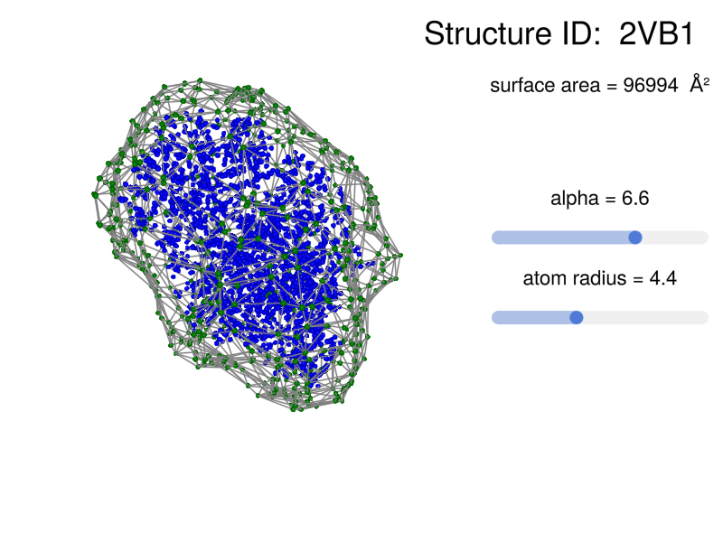

```@meta
EditURL = "<unknown>/src/Examples/alphashape/alphashape.jl"
```

# Alpha shape of a protein

````@example alphashape
using BioMakie
using GLMakie
using GLMakie: Slider
using SplitApplyCombine
using GeometryBasics
using BioStructures
````

SciPy and NumPy are required for this alpha shape algorithm. They need to be installed in your Conda/Python environment.

````@example alphashape
using PyCall
using Conda
scipy = pyimport_conda("scipy", "scipy")
np = pyimport_conda("numpy", "numpy")
collections = pyimport_conda("collections", "collections")
````

Define the alpha shape algorithm.

````@example alphashape
py"""
    from scipy.spatial import Delaunay
    import numpy as np
    from collections import defaultdict

    def alpha_shape_3D(pos, alpha):
        tetra = Delaunay(pos)
        tetrapos = np.take(pos,tetra.vertices,axis=0)
        normsq = np.sum(tetrapos**2,axis=2)[:,:,None]
        ones = np.ones((tetrapos.shape[0],tetrapos.shape[1],1))
        a = np.linalg.det(np.concatenate((tetrapos,ones),axis=2))
        Dx = np.linalg.det(np.concatenate((normsq,tetrapos[:,:,[1,2]],ones),axis=2))
        Dy = -np.linalg.det(np.concatenate((normsq,tetrapos[:,:,[0,2]],ones),axis=2))
        Dz = np.linalg.det(np.concatenate((normsq,tetrapos[:,:,[0,1]],ones),axis=2))
        c = np.linalg.det(np.concatenate((normsq,tetrapos),axis=2))
        r = np.sqrt(Dx**2+Dy**2+Dz**2-4*a*c)/(2*np.abs(a))
        tetras = tetra.vertices[r<alpha,:]
        TriComb = np.array([(0, 1, 2), (0, 1, 3), (0, 2, 3), (1, 2, 3)])
        Triangles = tetras[:,TriComb].reshape(-1,3)
        Triangles = np.sort(Triangles,axis=1)
        TrianglesDict = defaultdict(int)
        for tri in Triangles:
            TrianglesDict[tuple(tri)] += 1
        Triangles=np.array([tri for tri in TrianglesDict if TrianglesDict[tri] ==1])
        EdgeComb=np.array([(0, 1), (0, 2), (1, 2)])
        Edges=Triangles[:,EdgeComb].reshape(-1,2)
        Edges=np.sort(Edges,axis=1)
        Edges=np.unique(Edges,axis=0)
        Vertices = np.unique(Edges)
        return Vertices,Edges,Triangles
    """
````

Define a function to get the alpha shape of a set of coordinates.

````@example alphashape
indexshift(idxs) = (idxs).+=1   # Python is base 0 and Julia is base 1
function getalphashape(coords::Matrix, alpha::T) where {T<:Real}
    verts,edges,tris = py"alpha_shape_3D($(coords),$(alpha))"
    return [indexshift(verts),indexshift(edges),indexshift(tris)]
end
````

Define a function to get points from spheres at a given radius around coordinates
and a function to get line segments from a set of coordinates.

````@example alphashape
function getspherepoints(cords::Matrix, radius::Real)
	pnts = [GeometryBasics.Point{3,Float64}(cords[i,:]) for i in 1:size(cords,1)] |> Observable
	spheres = GeometryBasics.Point{3,Float64}[]

	@sync(@async lift(pnts) do p
		for i in 1:size(p,1)
			sp = GeometryBasics.decompose(GeometryBasics.Point{3,Float64},GeometryBasics.Sphere(p[i],radius),4) |> unique
			for ii in 1:size(sp,1)
				push!(spheres,sp[ii])
			end
		end
	end)

	return [[spheres[i].data...] for i in 1:size(spheres,1)] |> combinedims |> transpose |> collect
end
function linesegs(arr::AbstractArray{T,3}) where T<:AbstractFloat
    new_arr::AbstractArray{Point3f0} = []
    @sync(@async begin
        for i in 1:size(arr,1)
            push!(new_arr, Makie.Point3f0(arr[i,1,:]))
            push!(new_arr, Makie.Point3f0(arr[i,2,:]))
        end
    end)
    return new_arr |> combinedims |> transpose |> collect
end
````

Load the structure with BioStructures.jl and get a coordinates Observable.
Then set up the Figure and Layout.

````@example alphashape
struc = retrievepdb("2vb1")
atms = collectatoms(struc, standardselector) |> Observable
cords = @lift coordarray($atms)' |> collect
fig = Figure(resolution = (800,600))
layout = fig[1,1] = GridLayout(10, 9)
````

Add text and interactive elements. It can be helpful to run this line by line to see what is happening.

````@example alphashape
strucname = struc.name[1:4]
sc_scene = layout[1:10,1:6] = LScene(fig; show_axis = false)
structxt = layout[1,7:8] = Label(fig, text = "Structure ID:  $(strucname)", fontsize = 35)
alpha1 = layout[5,7:9] = Slider(fig, range = 1.5:0.01:9.0, startvalue = 2.5)
alphatxt1 = lift(alpha1.value) do s1; string("alpha = ", round(s1, sigdigits = 2)); end
alphatext = layout[4,7:9] = Label(fig, text = alphatxt1, fontsize = 22)
alphaval = alpha1.value
radii1 = layout[7,7:9] = Slider(fig, range = 1.5:0.01:9.0, startvalue = 2.5)
radiixt1 = lift(radii1.value) do s1; string("atom radius = ", round(s1, sigdigits = 2)); end
radiitext = layout[6,7:9] = Label(fig, text = radiixt1, fontsize = 22)
radiival = radii1.value
````

Get the alpha shape of the structure.

````@example alphashape
spnts = @lift getspherepoints($cords,$radiival)
proteinshape = @lift let pnts = $spnts; getalphashape(pnts,$alphaval); end
alphaverts = @lift $spnts[$(proteinshape)[1],:]
alphaedges = @lift $spnts[$(proteinshape)[2],:] |> linesegs
````

Finally, plot the shape. Moving the sliders will update the plot, but it is slow.
You may want to click on the slider rather than dragging it. Speed may be improved in the future.

````@example alphashape
linesegments!(sc_scene, alphaedges, color = :gray, transparency = true)
````

## Optional/additional stuff

#To show where the atoms are run the following line.

````@example alphashape
meshscatter!(sc_scene, cords, markersize = 0.4, color = :blue)
````

#To show the alpha shape vertices run the following line.

````@example alphashape
meshscatter!(sc_scene, alphaverts, markersize = 0.4, color = :green)
````

## Get the surface area of the alpha shape.
Define a function to get the surface area of a set of coordinates and connectivity.
The surface area changes when the alpha value or atom radius is changed.

````@example alphashape
using Meshes
function surfacearea(coordinates, connectivity)
    totalarea = 0.0
    @sync(@async begin
        for i = 1:size(connectivity,1)
            totalarea += measure(Ngon(Meshes.Point3.(coordinates[connectivity[i,1],:],
                            coordinates[connectivity[i,2],:], coordinates[connectivity[i,3],:])))
        end
    end)
    return totalarea
end
surfarea = @lift surfacearea($spnts, $(proteinshape)[3])
surfatext = layout[2,7:9] = Label(fig, text = lift(X->string("surface area = ", round(Int64, X), "  Ų"), surfarea), fontsize = 22)
````

Save the figure as a png file.

````@example alphashape
save("alphashape.png", fig)
````

<p align="center"></p>

---

*This page was generated using [Literate.jl](https://github.com/fredrikekre/Literate.jl).*

