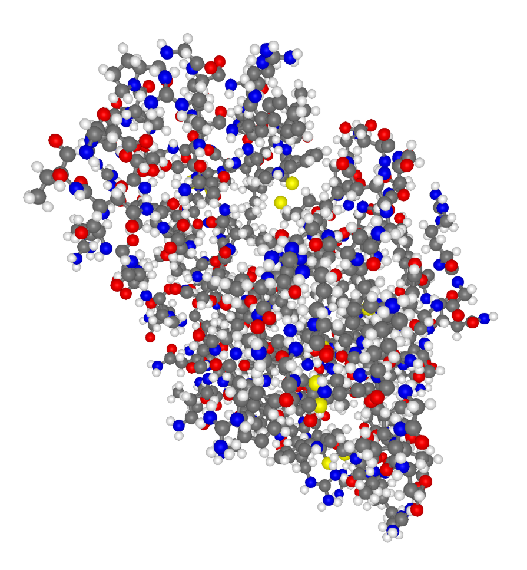
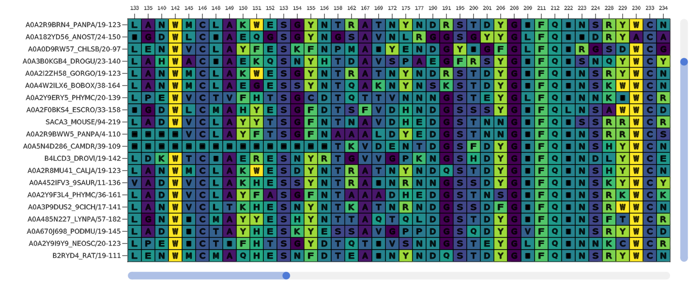

```@meta
EditURL = "https://github.com/kool7d/BioMakie.jl/master/src/GLusage.jl"
```

## Usage

To view a PDB structure, use the `viewstruc` function with a PDB ID or BioStructures protein structure.
```julia
sv = viewstruc("2VB1")
```
```julia
struc = retrievepdb("2vb1", dir = "data\\")
sv = viewstruc(struc)
```
```julia
struc = read("data\\2vb1_m1.pdb", BioStructures.PDB)
sv = viewstruc(struc)
```


To view a multiple sequence alignment, use the `viewmsa` function with a Pfam ID or fasta file.
```julia
mv = viewmsa("PF00062")
```
```julia
mv = viewmsa("data/fasta1.fas")
```

