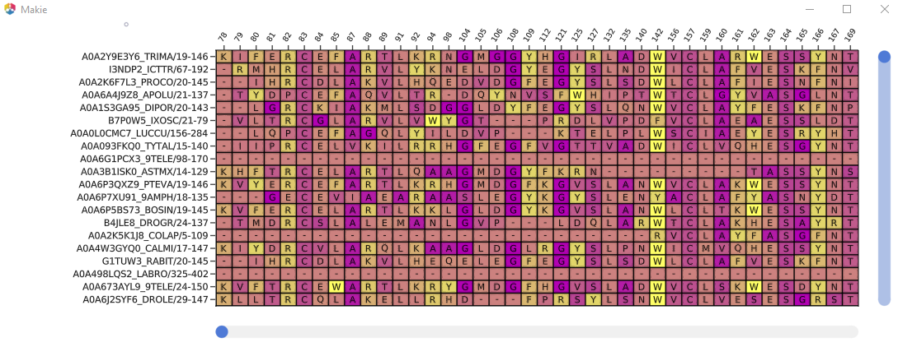

```@meta
CurrentModule = BioMakie
```

# BioMakie.jl

## Installation

Julia is required. This package is being developed with Julia 1.7, so some features may not work 
if an earlier version is used. Install the BioMakie master branch from the Julia REPL. Enter the 
package mode by pressing ] and run:

`add BioMakie#master`.

## Usage

To view a protein, use the `plotstruc` function with a BioStructures PDB structure.

```@example
using BioStructures
struc = retrievepdb("2vb1", dir = "data\\") |> Observable
# or #
struc = read("data\\2vb1.pdb", BioStructures.PDB) |> Observable

fig = Figure()
plotstruc!(fig, struc; plottype = :spacefilling, gridposition = (1,1), atomcolors = aquacolors)
plotstruc!(fig, struc; plottype = :covalent, gridposition = (1,2))
```


To view a multiple sequence alignment, use the `plotmsa` function with a Pfam MSA or fasta file.

```@example
using MIToS.MSA
downloadpfam("pf00062")
msa = MIToS.MSA.read("pf00062.stockholm.gz",Stockholm) |> Observable
# or #
using FASTX
reader = open(FASTX.FASTA.Reader, "PF00062_full.fasta")
msa = [record for record in reader]
close(reader)
# or #
using FastaIO
msa = FastaIO.readfasta("PF00062_full.fasta") |> Observable

msamatrix, xlabel, ylabel = getplottingdata(msa) .|> Observable

msafig, plotdata... = plotmsa(msamatrix;
				xlabels = xlabel, 	
				ylabels = ylabel, colorscheme = :buda)
```


## Additional examples

Documentation for advanced plotting will be available soon. 
Selection and multiple plots linked:


Animation of a mesh through different trajectories:

