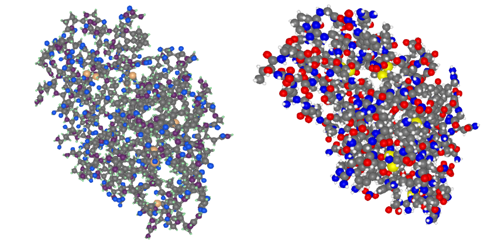
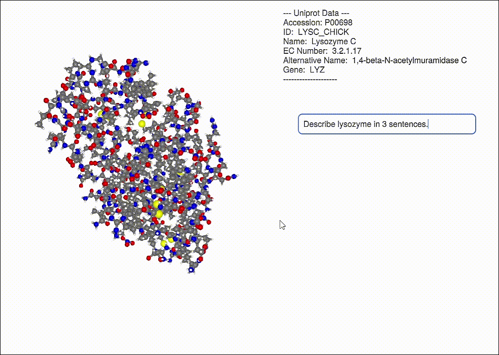
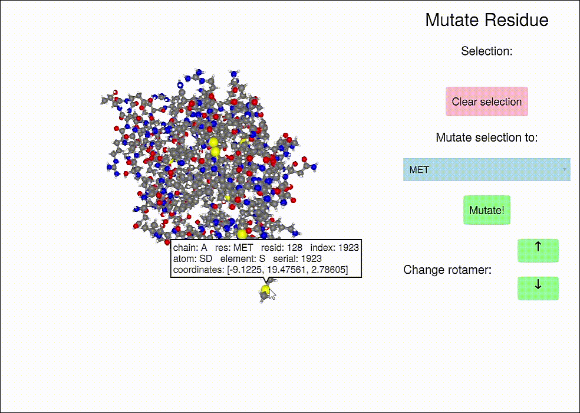

```@meta
EditURL = "https://github.com/kool7d/BioMakie.jl/blob/dev/docs/src/index.md"
```


**Status:**

[](https://github.com/BioJulia/BioMakie.jl/releases/latest)
[](https://github.com/BioJulia/BioMakie.jl/blob/master/LICENSE.md)
[](https://github.com/BioJulia/BioMakie.jl/actions/workflows/ci.yml)

## Installation

To install BioMakie, access the Julia package REPL by
pressing **`]`** from the Julia REPL, then run **`add BioMakie`**.

## Contributing and questions

Anyone can contribute to this package, by doing things like reporting bugs, fixing issues,
improving performance, adding new features, and adding examples. Feel free to open an **Issue** or **Pull Request**,
or communicate on the **#biology** or **#makie** channels of the [Julia Slack](https://join.slack.com/t/julialang/shared_invite/zt-1ab2rnvlw-mfODD9DJC_apVEULyKXDrA).

## About

This package provides plotting functions for protein structures, multiple sequence alignments, and some other related plots like protein structure contact maps. 
It also provides more complicated examples that show off additional functionality and interfaces. 
The main plotting functions are **plotstruc** and **plotmsa**, along with their mutating versions, **plotstruc!** and **plotmsa!**.

### Implemented packages:
Significant or full coverage: 
 - BioStructures.jl
 - MIToS.jl
 - FastaIO.jl
 - FASTX.jl

Some coverage:
 - MolecularGraph.jl
 - ProtoSyn.jl

### Implemented visualizations:
- Structures
  - Ball and stick, spacefilling, covalent representations
  - Selections
  - Alpha shapes
- Multiple sequence alignments
  - Grid display
  - Selections
  - Frequency plot
- Data acquisition and GPT-3.5-turbo API
- Mutating structural residues with ProtoSyn

### To Do:
- Non-standard and modified amino acids
- Connect MSA and structure plot
- Protein dynamics
- Better support for ligands and multiple chains
- Database web API interfaces
- WGLMakie support
- More examples

```julia
using BioMakie
using GLMakie
using BioStructures
struc = retrievepdb("2vb1") |> Observable
## or
struc = read("2vb1.pdb", BioStructures.PDB) |> Observable

fig = Figure()
plotstruc!(fig, struc; plottype = :ballandstick, gridposition = (1,1), atomcolors = aquacolors)
plotstruc!(fig, struc; plottype = :covalent, gridposition = (1,2))
```


To view a multiple sequence alignment, use the `plotmsa` function with a Pfam MSA or fasta file.

```julia
using FASTX
reader = open(FASTX.FASTA.Reader, "PF00062_full.fasta")
msa = [reader...] |> Observable
close(reader)
## or 
using MIToS
using MIToS.MSA
msa = MIToS.MSA.read("pf00062.stockholm.gz", Stockholm)

fig = plotmsa(msa; colorscheme = :tableau_blue_green)
```


## Other examples

### Viewing the frequencies of amino acids in a multiple sequence alignment


### Alpha shapes can be used to visualize the surface of a protein structure


### Database information can be displayed for a protein (including a GPT response, OpenAI.jl)


### Protein residue mutation and changing rotamers (with ProtoSyn.jl) 

