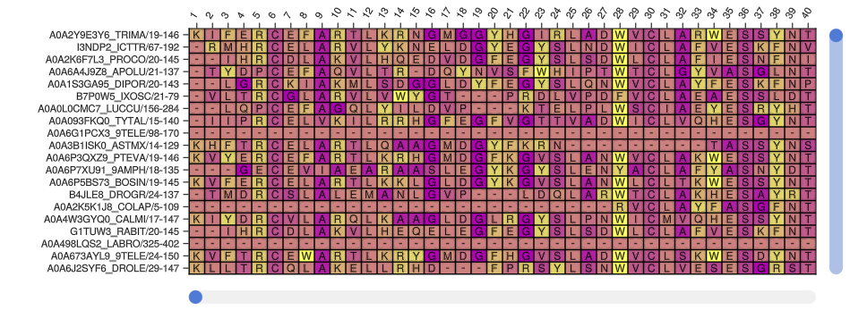

```@meta
EditURL = "https://github.com/kool7d/BioMakie.jl/blob/dev/docs/src/msaselection.md"
```

# MSA Selection
In this demo we plot an MSA and allow the user to select a residue.
The selected residue is highlighted in the MSA and the amino acid frequencies
are plotted on the right.

## Copy-pastable code
````julia
using BioMakie
using MIToS.MSA, MIToS.Pfam
using GLMakie
using Lazy
downloadpfam("pf00062")
msa1 = read_file("pf00062.stockholm.gz",Stockholm)
msa2 = Observable(msa1)
plotdata = plottingdata(msa2)
fig = Figure(resolution = (1400,400))
msa = plotmsa!(fig, plotdata)
coldata = lift(plotdata[:selected]) do sel
    try
        plotdata[:matrix][][:,parse(Int,sel)]
    catch
        ["-" for i in 1:size(plotdata[:matrix][])[1]]
    end
end
allaas = [  "R", "M", "N", "E", "F",
            "I", "D", "L", "A", "Q",
            "G", "C", "W", "Y", "K",
            "P", "T", "S", "V", "H",
            "X", "-"]
sortaas = sortperm(allaas)
new_aalabels = allaas[sortaas]
hydrophobicities = [BioMakie.kideradict[new_aalabels[i]][2] for i in 1:length(new_aalabels)]
countmap1 = @lift frequencies($coldata) |> sort
aas = @lift collect(keys($countmap1))
freqs = lift(aas) do a
    collect(values(countmap1[]))
end
missingaas = @lift setdiff(allaas,$aas) |> sort
missingfreqs = @lift zeros(length($missingaas))
perm1 = @lift sortperm([$aas; $missingaas])
aafreqs = @lift ([freqs[];$missingfreqs])[$perm1]
aafreqspercent = @lift $aafreqs ./ sum($aafreqs) .* 100
new_aafreqs = @lift $aafreqspercent[sortaas]
ax = Axis(fig[1,4], xticklabelsize = 16, yticks = (0:10:100), yticklabelsize = 20,
            title = "Amino Acid Percentages",
            titlesize = 18, xticks = (1:22,new_aalabels)
)
bp = barplot!(ax, 1:22, aafreqspercent; color = hydrophobicities, strokewidth = 1,
                xtickrange=1:22, xticklabels=new_aalabels
)
ylims!(ax, (0, 100))
xlims!(ax, (0, 23))
````


## Imports
````julia
using BioMakie
using MIToS.MSA, MIToS.Pfam
using GLMakie
using Lazy
````

## Acquire the data
Use MIToS to download a Pfam MSA, then prepare the plotting data.

````julia
downloadpfam("pf00062")
msa1 = read_file("pf00062.stockholm.gz",Stockholm)
msa2 = Observable(msa1)
plotdata = plottingdata(msa2)
````

## Plot the MSA
We make the figure resolution a bit bigger than default because we want to
add in the frequency plot on the right.

````julia
fig = Figure(resolution = (1400,400))
msa = plotmsa!(fig, plotdata)
````



Prepare column data for the frequency plot. In this example we color based
on hydrophobicity value from a set of physicochemical property values,
the Kidera factors.

````julia
coldata = lift(plotdata[:selected]) do sel
    try
        plotdata[:matrix][][:,parse(Int,sel)]
    catch
        ["-" for i in 1:size(plotdata[:matrix][])[1]]
    end
end
allaas = [  "R", "M", "N", "E", "F",
            "I", "D", "L", "A", "Q",
            "G", "C", "W", "Y", "K",
            "P", "T", "S", "V", "H",
            "X", "-"]
sortaas = sortperm(allaas)
new_aalabels = allaas[sortaas]
hydrophobicities = [BioMakie.kideradict[new_aalabels[i]][2] for i in 1:length(new_aalabels)]
````

## Create the Observables to sync the data between the MSA and the frequency plot.
Utilize observables to update the frequency plot when the user selects a residue.

````julia
countmap1 = @lift frequencies($coldata) |> sort
aas = @lift collect(keys($countmap1))
freqs = lift(aas) do a
    collect(values(countmap1[]))
end
missingaas = @lift setdiff(allaas,$aas) |> sort
missingfreqs = @lift zeros(length($missingaas))
perm1 = @lift sortperm([$aas; $missingaas])
aafreqs = @lift ([freqs[];$missingfreqs])[$perm1]
aafreqspercent = @lift $aafreqs ./ sum($aafreqs) .* 100
new_aafreqs = @lift $aafreqspercent[sortaas]
````

## Create the frequency plot
The keyword arguments for the Axis and barplot are adjusted to make it look nice.

````julia
ax = Axis(fig[1,4], xticklabelsize = 16, yticks = (0:10:100), yticklabelsize = 20,
            title = "Amino Acid Percentages",
            titlesize = 18, xticks = (1:22,new_aalabels)
)
bp = barplot!(ax, 1:22, aafreqspercent; color = hydrophobicities, strokewidth = 1,
                xtickrange=1:22, xticklabels=new_aalabels
)
ylims!(ax, (0, 100))
xlims!(ax, (0, 23))
````

---

*This page was generated using [Literate.jl](https://github.com/fredrikekre/Literate.jl).*

