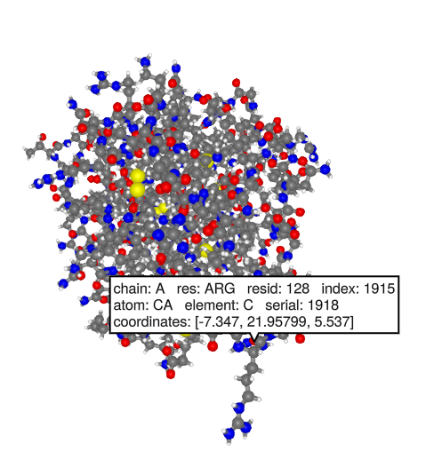

```@meta
EditURL = "https://github.com/kool7d/BioMakie.jl/blob/dev/docs/src/mutation.md"
```

# ProtoSyn Protein Mutation
In this demo we can use ProtoSyn to mutate amino acids. Different
rotamers can be selected for the mutated residue. To use ProtoSyn
you currently have to use a workaround.

## Load BioMakie and ProtoSyn
Download the protosyn source code from the src directory of BioMakie
and `include` it. This should install a few packages (SplitApplyCombine,
Colors, Meshes, GeometryBasics, OrderedCollections, Distances) and then
import ProtoSyn.

````julia
using BioMakie
using GLMakie

BioMakie.getprotosyn()
include("protosyn.jl")
````

## Prepare the structure
To simplify things, we will load a structure with BioStructures and
save chain "A" as a PDB file. Then we will load the PDB file with ProtoSyn.

````julia
using BioStructures
struc = retrievepdb("2vb1")
chn = collectresidues(struc[1]["A"], standardselector)
writepdb("2vb1x.pdb", chn)

pose = ProtoSyn.Peptides.load("2vb1x.pdb"; bonds_by_distance=true) |> Observable
````

## Get plotting data for the Pose and plot it

````julia
pdata = plottingdata(pose)
fig = Figure()
_plotstruc!(fig, pdata)
````



## Prepare the structure
We can use `diagnose` to get an idea of what is missing and of inconsistencies
in the structure.

````julia
ProtoSyn.Peptides.diagnose(pose[])
````

We have several issues, including charges, naming, and caps, which are the
terminal hydrogens. We can use the following functions to address these issues.
First we load the library of amino acids, to get the Peptide/protein-specific
data, instead of the default generic data.

````julia
res_lib = ProtoSyn.load_grammar_from_file(ProtoSyn.resource_dir*"/Peptides/grammars.yml", "default")
ProtoSyn.Peptides.cap!(pose[])
ProtoSyn.Peptides.assign_default_atom_names!(pose[])
ProtoSyn.sort_atoms_by_graph!(pose[])
ProtoSyn.Peptides.Calculators.Electrostatics.assign_default_charges!(pose[], res_lib)

ProtoSyn.Peptides.diagnose(pose[])
````

Now the issues should say `OK`, except for the atom-level graph. We can ignore this for now.
This `fixpose!` function below may be convenient for syncing and correcting the structure
after making changes. Using `pose[] = pose[]` can force Makie to update the pose/figure.

````julia
function fixpose!(pose::Observable; res_lib=ProtoSyn.load_grammar_from_file(ProtoSyn.resource_dir*"/Peptides/grammars.yml", "default"))
    ProtoSyn.Peptides.cap!(pose[])
    ProtoSyn.Peptides.assign_default_atom_names!(pose[])
    ProtoSyn.sort_atoms_by_graph!(pose[])
    ProtoSyn.Calculators.Electrostatics.assign_default_charges!(pose[],res_lib)
    ProtoSyn.Peptides.sync!(pose[])
    pose[] = pose[]
end
````

## Mutate the structure
Get information about a residue. In this example we will use residue 128 because it is
easy to find on the structure. The long side chain of this arginine extends outward the furthest.

````julia
pose[].graph[1][128]
````

Next lets try mutating it to tyrosine. We can use the `mutate!` function to do this.
Combine it with `fixpose!` to get the updated structure. You should see the side chain
change into the phenol ring of tyrosine.

````julia
ProtoSyn.Peptides.mutate!(pose[], pose[].graph[1][128], res_lib, seq"Y")
fixpose!(pose)
````


To choose different rotamers/orientations, we can use the rotamer library. ProtoSyn
provides a stack of the most likely rotamers based on the dihedral angles of the residue.

````julia
rot_lib = ProtoSyn.Peptides.load_dunbrack()
phi = ProtoSyn.getdihedral(pose[].state, ProtoSyn.Peptides.phi(pose[].graph[1][128]))
psi = ProtoSyn.getdihedral(pose[].state, ProtoSyn.Peptides.psi(pose[].graph[1][128]))
stack = rot_lib["TYR"][phi, psi]

ProtoSyn.Peptides.apply!(pose[].state, stack[3], pose[].graph[1][128])
fixpose!(pose)
````


---

*This page was generated using [Literate.jl](https://github.com/fredrikekre/Literate.jl).*

