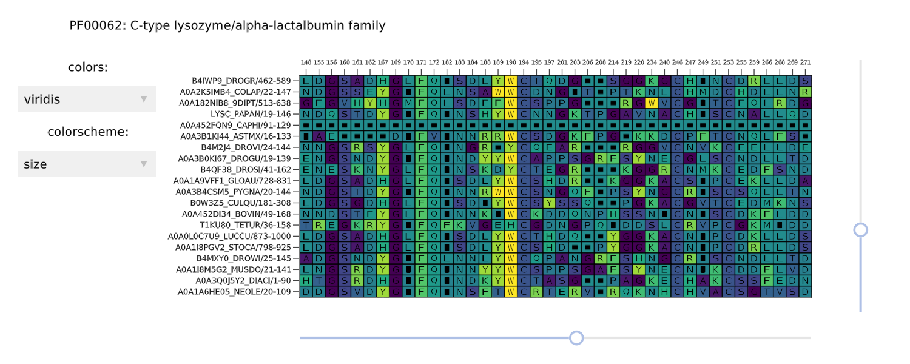

```@meta
EditURL = "<unknown>/src/proteins.jl"
```

Proteins

```@example proteins
# Structures

You can load a Protein Structure from the PDB (Protein Data Bank):

```@example proteins
pstruc1 = viewstruc("2VB1")
```

# Multiple sequence alignments

You can similarly load a Multiple Sequence Alignment from the Pfam database:
```@example proteins
msa1 = viewmsa("PF00062")
```
```



An `MSAView` contains the most relevant information about the protein sequences in the
alignment along with the `Scene` and `Layout` which comprise the interface.

---

*This page was generated using [Literate.jl](https://github.com/fredrikekre/Literate.jl).*

