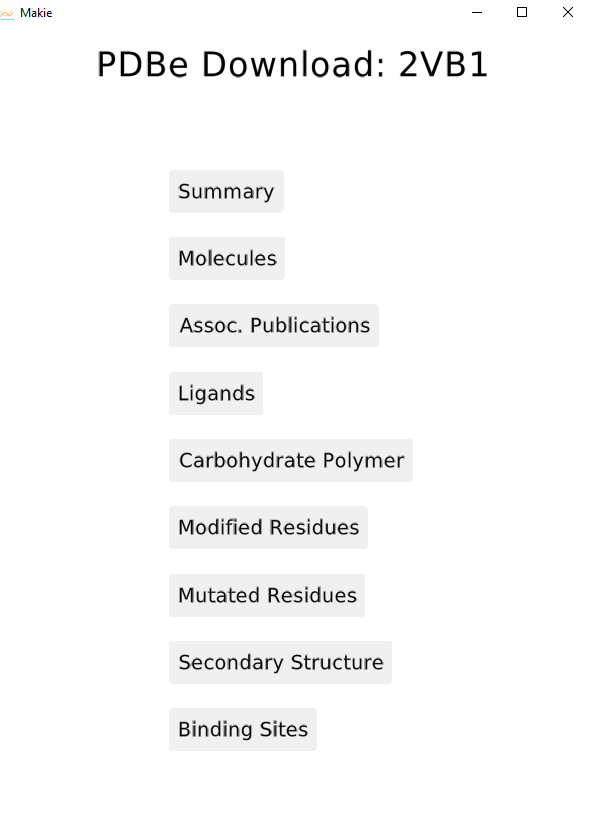

```@meta
EditURL = "https://github.com/kool7d/BioMakie.jl/master/docs/src/GLusage.jl"
```

## Usage

To view a PDB structure, use the `viewstruc` function.
```julia
using BioStructures
struc = retrievepdb("2vb1", dir = "data\\") |> Node
sv = viewstruc(struc)

struc = read("data\\2vb1_mutant1.pdb", BioStructures.PDB) |> Node
sv = viewstruc(struc)
```


To view a multiple sequence alignment, use the `viewmsa` function with a Pfam MSA or fasta file.
```julia
using MIToS.MSA
downloadpfam("pf00062")
vm = MIToS.MSA.read("pf00062.stockholm.gz",Stockholm) |> Node
fig1 = viewmsa(vm)

using FastaIO
vm = FastaIO.readfasta("data/fasta1.fas") |> Node
fig1 = viewmsa(vm)
```


Here is a downloader for data from PDBe. Call it with `PDBe_downloader(pdbid)`.
```julia
fig = PDBe_downloader("2vb1")

pdbid = "2vb1" |> Node
fig = PDBe_downloader(pdbid)
```



```@example 1
using JSServe
Page(exportable=true, offline=true)
```
```@example 1
using WGLMakie, BioStructures
WGLMakie.activate!()
fig = Figure()
lscene = LScene(fig[1, 1], scenekw = (camera = cam3d!, raw = false))
struc = retrievepdb("2vb1")
cords = coordarray(collectatoms(struc,standardselector))
meshscatter!(lscene,cords;show_axis=false)

```
