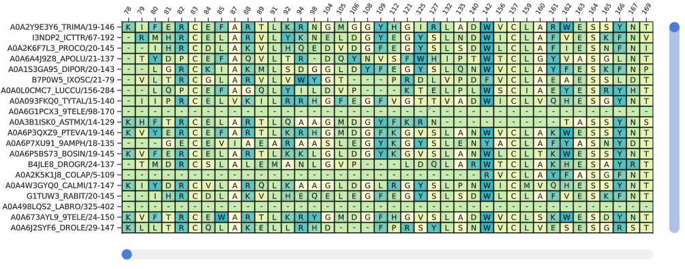

```@meta
EditURL = "<unknown>/src/usage.jl"
```

## Usage

The main plotting functions are **plotstruc** and **plotmsa**, along with their mutating
versions, **plotstruc!** and **plotmsa!**. The mutating functions allow the user to add multiple
plots to the same Figure, using grid positions.

### Structure

There are different representations for protein structures, including "ball and stick"
(**:ballandstick**), "covalent" (**:covalent**), and "space filling" (**:spacefilling**). The
default Makie backend is GLMakie.jl, but some of the functions work with WGLMakie.

````@example usage
using BioMakie
using GLMakie
using BioStructures
struc = retrievepdb("2vb1") |> Observable
# or
struc = read("2vb1.pdb", BioStructures.PDB) |> Observable
````

````@example usage
fig = Figure()
plotstruc!(fig, struc; plottype = :ballandstick, gridposition = (1,1), atomcolors = aquacolors, resolution = (350,600))
plotstruc!(fig, struc; plottype = :covalent, gridposition = (1,2), resolution = (350,600))
````

### Multiple Sequence Alignments

Multiple Sequence Alignments (MSAs) are plotted using a matrix of residue letters, and a
matrix of values for the heatmap colors. If only a matrix of letters is provided as input,
colors will be automatic. MSA objects from MIToS have specific support, as well as Fasta files
loaded with FastaIO.jl or FASTX.jl.

To view a multiple sequence alignment, use the `plotmsa` or `plotmsa!` function with a Pfam MSA or fasta file.

````@example usage
using FASTX
reader = open(FASTX.FASTA.Reader, "./docs/src/assets/PF00062.fasta")
msa = [reader...] |> Observable
close(reader)
# or
using MIToS
using MIToS.MSA
msa = MIToS.MSA.read("./docs/src/assets/pf00062.stockholm.gz", Stockholm)

fig = plotmsa(msa; colorscheme = :tableau_blue_green, resolution = (700,400))
````



## Additional examples

Alpha shapes can be used to visualize the surface of a protein structure


---

*This page was generated using [Literate.jl](https://github.com/fredrikekre/Literate.jl).*

